# Esquema de Base de Datos

A continuación se detalla el diseño de la base de datos relacional para el sistema.

## Diagrama Entidad-Relación (Mermaid)

```mermaid
erDiagram
    USERS ||--o{ MINISTRY_USER : "pertenece a"
    MINISTRIES ||--o{ MINISTRY_USER : "tiene miembros"
    USERS ||--o{ ROLE_USER : "tiene roles"
    ROLES ||--o{ ROLE_USER : "asignado a"
    ROLES ||--o{ PERMISSION_ROLE : "tiene permisos"
    PERMISSIONS ||--o{ PERMISSION_ROLE : "pertenece a"

    USERS {
        bigint id PK
        string name
        string email
        string password
        string phone "Opcional"
        timestamp email_verified_at
        boolean is_active
        timestamps created_at
    }

    MINISTRIES {
        bigint id PK
        string name "Ej: Alabanza, Finanzas, Marketing"
        string slug "Identificador para la URL/Ruta"
        text description
        string icon "Icono para el menú del dashboard"
        boolean is_active
        timestamps created_at
    }

    MINISTRY_USER {
        bigint id PK
        bigint user_id FK
        bigint ministry_id FK
        boolean is_leader "Si es líder en este ministerio específico"
        timestamps created_at
    }

    ROLES {
        bigint id PK
        string name "Ej: SuperAdmin (Técnico), User"
        string slug
        timestamps created_at
    }

    PERMISSIONS {
        bigint id PK
        string name "Ej: create_events"
        string slug
        timestamps created_at
    }

    BANNERS {
        bigint id PK
        string title
        string subtitle
        string image_url
        string button_text
        string button_link
        integer order
        boolean is_active
        timestamps created_at
    }

    EVENTS {
        bigint id PK
        bigint ministry_id FK "Opcional: Evento de un ministerio específico"
        string title
        string slug
        text description
        datetime start_date
        datetime end_date
        string location
        string image_url
        bigint created_by FK
        boolean is_published
        timestamps created_at
    }

    SERMONS {
        bigint id PK
        string title
        string slug
        text description
        string preacher
        string video_url
        string audio_url
        date sermon_date
        boolean is_published
        timestamps created_at
    }

    CHURCH_CONFIG {
        bigint id PK
        string key
        text value
        timestamps created_at
    }

    RESOURCES {
        bigint id PK
        string title
        string slug
        text description
        string file_url
        string file_type
        integer file_size
        string category
        bigint ministry_id FK
        bigint uploaded_by FK
        integer downloads
        boolean is_published
        timestamps created_at
    }
```

## Descripción de Tablas y Relaciones

### 1. Ministerios y Usuarios (Núcleo Dinámico)

*   **ministries**: Tabla central para la organización.
    *   **Dinámica**: Cada registro aquí (Ej: "Alabanza", "Finanzas") generará automáticamente una opción en el menú del Dashboard.
    *   **Campo `icon`**: Para personalizar cómo se ve en el menú lateral.
*   **ministry_user**: Tabla pivote (Muchos a Muchos).
    *   Permite que un usuario pertenezca a **múltiples ministerios** simultáneamente (Ej: Alguien puede estar en "Alabanza" y "Marketing").
    *   `is_leader`: Define si el usuario administra ese ministerio en particular.

### 2. Autenticación y Roles Globales

*   **users**: Usuarios del sistema.
*   **roles**: Roles técnicos globales (Ej: `SuperAdmin` que ve todo, `User` normal).
    *   *Nota*: La gestión del día a día se hará principalmente a través de los Ministerios, pero los Roles sirven para permisos de sistema (borrar usuarios, configuración global).

### 3. Contenido Web (CMS)

*   **events**: Ahora incluye `ministry_id` (FK) para que cada ministerio pueda gestionar su propio calendario de eventos.
*   **banners, sermons, church_config**: Gestión de contenido general.
